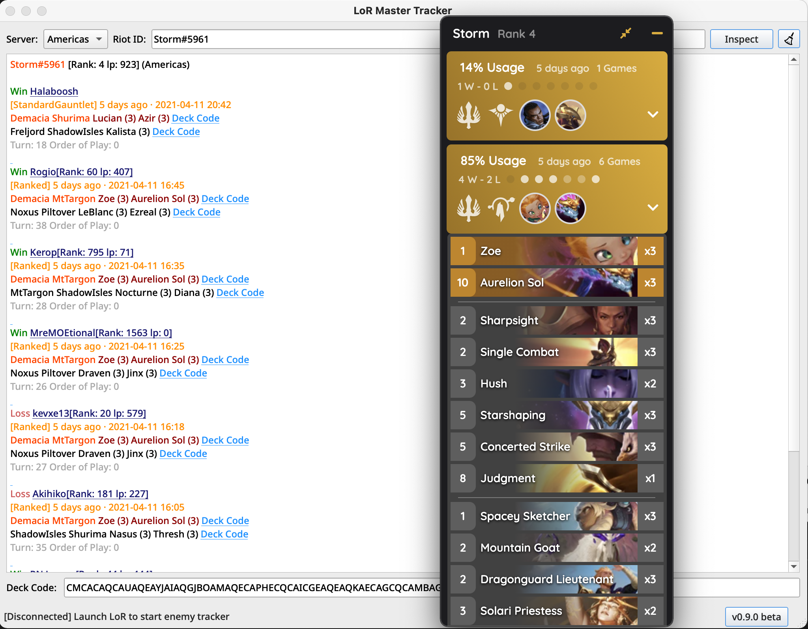
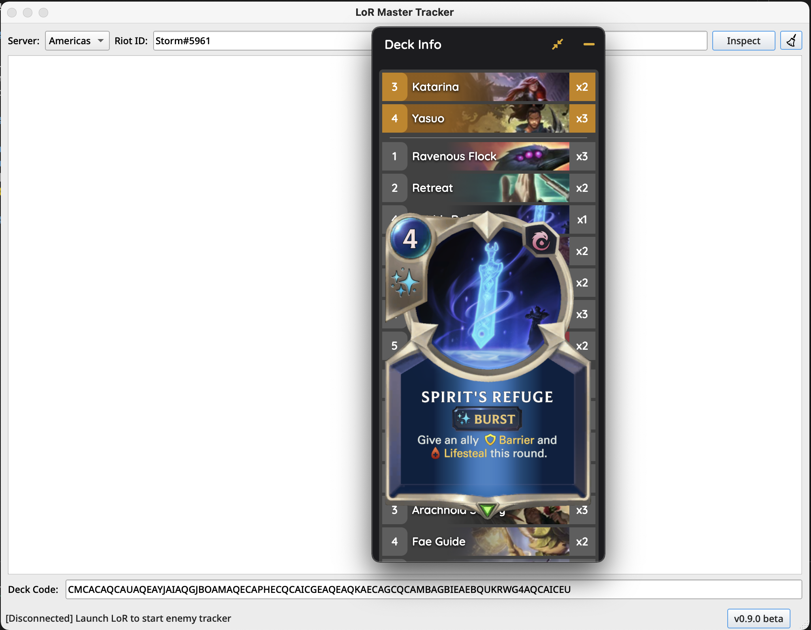
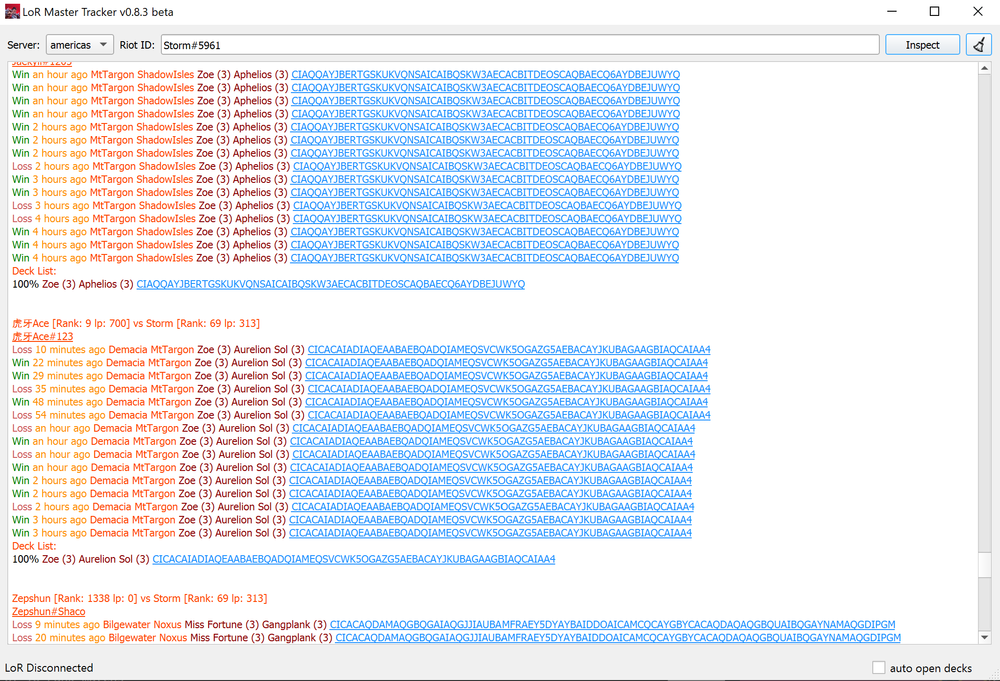

# LoR Master Tracker-beta

## We are open source now!

<p align="center">

</p>

<p align="center">
    <a href="https://github.com/shaobaili3/lor_master/releases"></a>
    <a href="https://www.python.org/downloads/">.svg"/></a>
    <a href="https://github.com/shaobaili3/LoR_Master/blob/master/LICENSE"></a>

</p>

LoR Master Tracker is a history tracker and deck inspector for League of Runeterra.

## Installation

* Requirements: Windows 7 or higher
* [Click here to download](https://github.com/shaobaili3/LoR_Master/releases/download/v0.9.4-beta/LoRMasterTracker-v0.9.4-beta.exe)
* [Changelogs](https://github.com/shaobaili3/lor_master/releases)

## Features

* **Player Inspector**

    By simply providing the player name, LMT can inspect recent matches. Multiple Language player names are supported.


* **In-game Deck Code Viewer**

    LMT can view the deck by entering the deck code. The viewer can be displayed in-game.


* **In-game Enemy Deck Tracker**

    At the game beginning, the opponent decks, rank and lp automatically revealed by real-time enemy tracker.
    
    > ### ⚠️ Disclaimer:
    > Opponent decks are pulled from recent 10 matches by Riot API. Even if there is no third-parties data requests, this function may still create an unfair advantage for players, which may violate [POLICIES](https://developer.riotgames.com/policies/general). We are still working on the adjustment for this function. We may remove it in the next version. We are looking forward to getting feedback from the community and Riot and actively upgrade LMT.




## Development

LoR Master Tracker backend is written by pure [Python3](https://www.python.org/downloads/) for cross-platform and local port retrieval. The main Interface is built by [PyQt6](https://riverbankcomputing.com/software/pyqt/download), the In-game UI is built by [Electron](https://www.electronjs.org/) and [Vuejs](https://github.com/vuejs/vue)

## Build Instructions

Pre-requisites:

* To run command line tools, you'll need to configure Python3
* npm

1. Clone or Download the repository:

  ```shell
  git clone https://github.com/shaobaili3/LoR_Master
  ```

2. Run Python backend + main UI

  ```shell
  pip install -r requirements.txt
  python LoRMasterTracker.py
  ```

  If this errors out, make sure that you have an `Python3` environment
  variable pointing to the right path.

3. Run Electron in-game UI

  ```shell
  cd UI
  npm install
  npm run dev
  npm run package
  ```

  Make sure you are in `UI` directory.

## FAQ

**Q.** Is using LoR Master Tracker considered cheating?  
**A.** This project is registered in the [Riot Development Portal](https://developer.riotgames.com/) and the API key is proved by [Riot](https://www.riotgames.com/en). All data source is from [Riot API](https://developer.riotgames.com/apis) and [LoR Data Dragon](https://developer.riotgames.com/docs/lor). There is zero third-party data source and no third-party API.

### Built with ❤ by Storm & FlyingFish