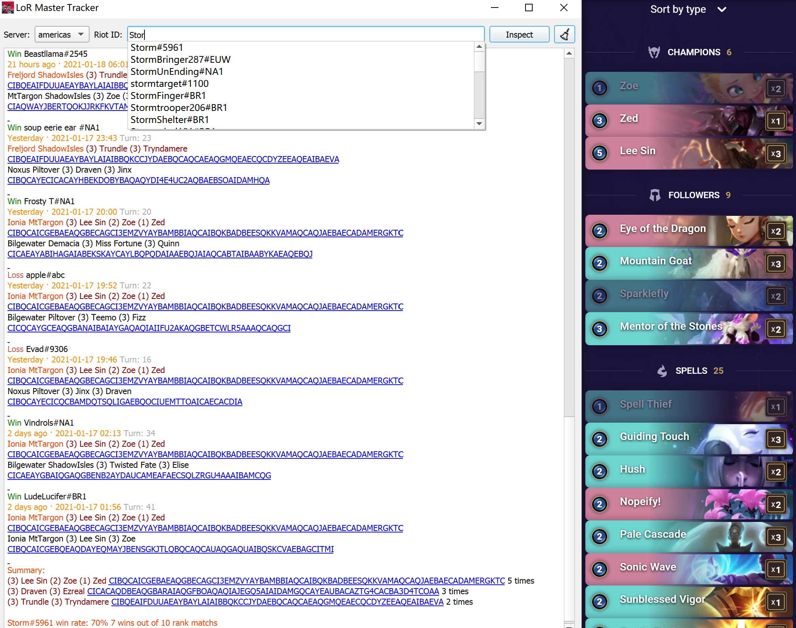

# LoR Master Tracker-beta

    
    <a href="">.svg"/></a>
    
    
    

LoR Master Tracker is a history tracker and deck inspector for League of Runeterra.

## Installation

* Requirements: Windows 7 or higher
* [Download](https://github.com/shaobaili3/lor_master/releases/download/v0.5.0-beta/LoRMasterTracker-v0.5.0-beta.zip)
* [Release page](https://github.com/shaobaili3/lor_master/releases)

## Features

* **Player History Rank Matches Inspector**

    By simply providing the player name, LMT can inspect recent rank matches. Multiple Language player names are supported.

* **In-game Opponent Deck Revealer (Coming soon...)**

    At the game beginning, the opponent deck automatically revealed.

