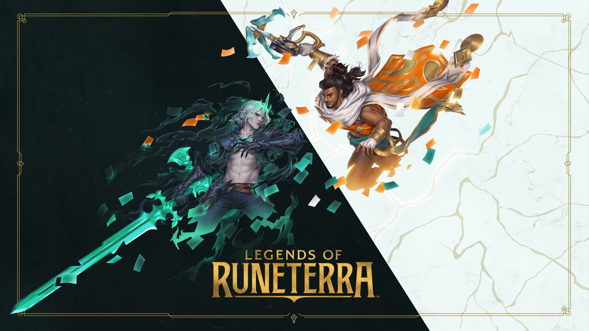
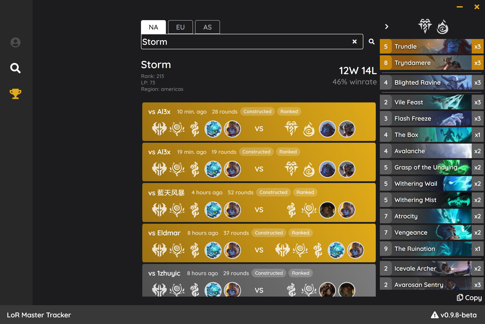
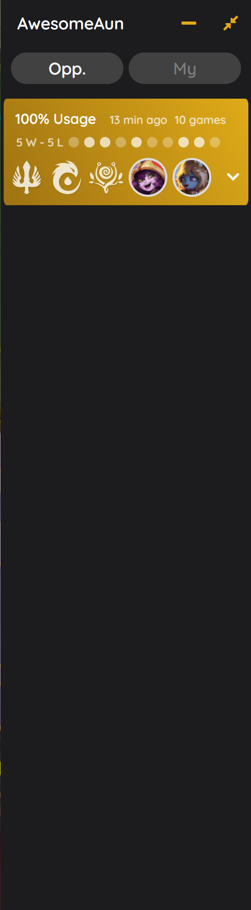
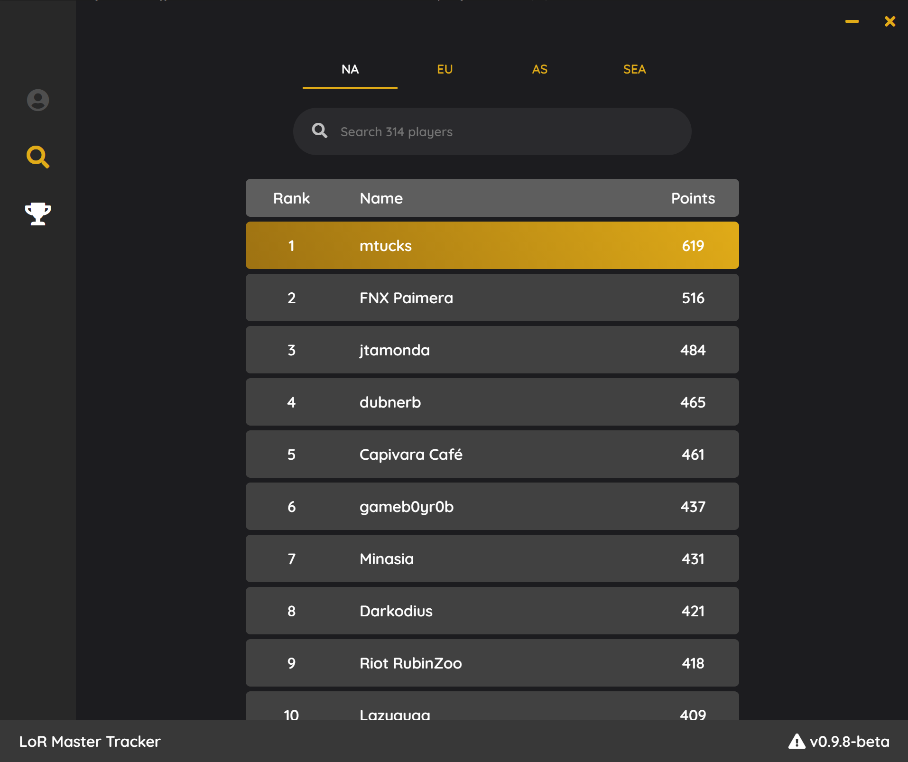

# LoR Master Tracker-beta

<p align="center">

</p>

<p align="center">
    <a href="https://github.com/shaobaili3/lor_master/releases"></a>
    <a href="https://www.python.org/downloads/">.svg"/></a>
    <a href="https://github.com/shaobaili3/LoR_Master/blob/master/LICENSE"></a>

</p>

LoR Master Tracker is a open source deck tracker and history inspector for League of Runeterra.

## [Download](https://github.com/shaobaili3/LoR_Master/releases/download/v0.9.12/LoRMasterTracker-Setup-0.9.12.exe)

* Requirements: Windows 7 or higher
* [Click here to download](https://github.com/shaobaili3/LoR_Master/releases/download/v0.9.12/LoRMasterTracker-Setup-0.9.12.exe)
* [Changelogs](https://github.com/shaobaili3/lor_master/releases)

## Features

* **Player Profile**

    Player Profile displays all your match history with analytical data.


* **Player Inspector**

    By simply providing the player name, Player Inspector shows match history and statistics. Multiple Language player names are supported.


* **Deck Tracker**

    At the game beginning, players' decks, opponent history, rank, both graveyards and cards in hand number automatically revealed by real-time deck tracker.

   
    > ### Disclaimer:
    > Opponent history are pulled from recent 10 matches by [Riot API](https://developer.riotgames.com/apis). Riot suggested website [DAK.GG](https://dak.gg/lor) provides the same functionality. We are looking forward to getting feedback from the community and Riot.

* **Master Leaderboard**

    Master Leaderboard is powered by open-source [LMT Crawler](https://github.com/LoR-Master-Tracker/LoR-Player-Crawler). You can inspect master players via clicking player names.


* **Deck Code Viewer(Coming soon)**

    The deck viewer can be displayed in-game and outside the game via entering the deck codes.


## Development

LoR Master Tracker backend service is written by [Python3](https://www.python.org). The user interface is built by [Electron](https://www.electronjs.org/) and [Vuejs](https://github.com/vuejs/vue)

## Build Instructions

Pre-requisites:

* To run command line tools, you'll need to configure Python3
* npm

1. Clone or Download the repository:

  ```shell
  git clone https://github.com/shaobaili3/LoR_Master
  ```

2. Run Python Service

  ```shell
  pip install -r requirements.txt
  python LMTService.py
  ```

  If this errors out, make sure that you have an `Python3` environment
  variable pointing to the right path.

3. Run Electron User Interface

  ```shell
  cd UI
  npm install
  npm run dev
  ```

  Make sure you are in `UI` directory.

## FAQ

**Q.** Is using LoR Master Tracker considered cheating?  
**A.** This project is registered in the [Riot Development Portal](https://developer.riotgames.com/) and API keys are authorized by [Riot](https://www.riotgames.com/en). All data source is from [Riot API](https://developer.riotgames.com/apis) and [LoR Data Dragon](https://developer.riotgames.com/docs/lor). There is no third-party data source or API. There is also no local or remote database, all cached data saves locally in the LMT root folder.

### Built with ❤ by Storm & FlyingFish
